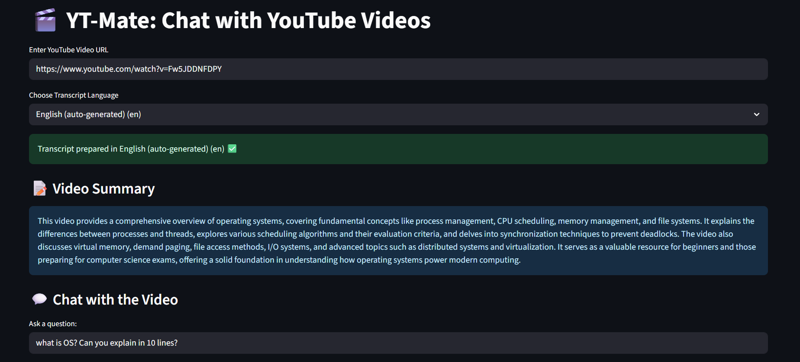
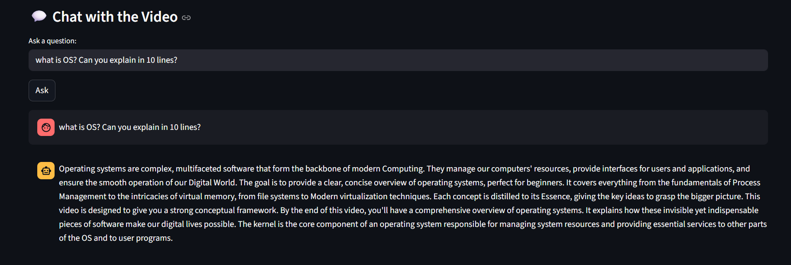

# 🎬 YT-Mate: Chat with YouTube Videos

Transform any YouTube video into an intelligent conversational partner! YT-Mate uses advanced AI to let you chat directly with video content, get instant summaries, and find specific information without watching hours of footage.

## ✨ Features

- **🗣️ Multi-Language Support** - Extract and chat with transcripts in multiple languages
- **📝 Auto-Generated Summaries** - Get brief, informative summaries before diving into conversations
- **💬 Natural Conversations** - Ask questions in natural language and get contextually accurate answers
- **🔍 Intelligent Retrieval** - Powered by vector embeddings and semantic search
- **⚡ Fast Processing** - Cached vector stores for instant responses
- **🎯 Accurate Responses** - Answers based solely on video content, no hallucinations

## 🎥 Demo

<div align="center">
  
  
</div>

## 🛠️ Technology Stack

- **Frontend**: Streamlit (Web UI)
- **LLM**: Google Gemini 2.0 Flash
- **Embeddings**: Google Generative AI Embeddings
- **Vector Store**: FAISS
- **Text Processing**: LangChain
- **Transcript Extraction**: YouTube Transcript API

## 📖 How to Use

1. **Paste YouTube URL** - Enter any YouTube video URL in the input field
2. **Select Language** - Choose from available transcript languages
3. **Get Summary** - Receive an auto-generated brief summary of the video
4. **Start Chatting** - Ask questions about the video content
5. **Get Answers** - Receive accurate, context-aware responses

## 🎯 Use Cases

- **📚 Education** - Study from educational videos and lectures
- **🔬 Research** - Extract information from interviews and documentaries
- **💼 Professional** - Review meeting recordings and training materials
- **📺 Entertainment** - Get quick insights from long-form content
- **🌍 Language Learning** - Practice with content in different languages

## 📁 Project Structure in Sequence

```
yt-mate/
├── app.py                    # Streamlit web interface
├── summarize.py             # Video summarization
├── main.py                   # Command-line interface with chains
├── generation_answer.py     # LLM response generation
├── augumentation.py         # Prompt augmentation with context
├── retriever.py             # Similarity search and retrieval
├── embedding_generation.py  # Vector embedding creation
├── text_splitter.py         # Text chunking utilities
├── transcript_extraction.py  # YouTube transcript extraction
├── requirements.txt         # Python dependencies
├── .env                     # Environment variables (create this)
└── faiss_index/            # Vector store cache (auto-created)
```

## 🤖 How It Works

YT-Mate implements a **Retrieval-Augmented Generation (RAG)** pipeline:

1. **Transcript Extraction** - Fetches video transcripts using YouTube's API
2. **Text Chunking** - Splits transcript into manageable, overlapping chunks
3. **Vector Embeddings** - Converts text chunks into numerical representations
4. **Vector Storage** - Stores embeddings in FAISS for fast similarity search
5. **Query Processing** - Converts user questions into embeddings
6. **Similarity Search** - Finds most relevant transcript chunks
7. **Context Augmentation** - Combines relevant chunks with user query
8. **Response Generation** - Uses Gemini LLM to generate contextual answers

## 🚧 Limitations

- Only works with videos that have transcripts available
- Limited to languages supported by YouTube's transcript service
- Requires internet connection for API calls

## 🙏 Acknowledgments

- YouTube Transcript API for transcript extraction
- Google Gemini for powerful language understanding
- LangChain for RAG pipeline components
- Streamlit for the intuitive web interface
- FAISS for efficient vector similarity search

## 🚀 Installation

### Prerequisites

- Python 3.8+
- Google API Key (for Gemini)

### Setup

1. **Clone the repository**

   ```bash
   git clone https://github.com/yourusername/yt-mate.git
   cd yt-mate
   ```

2. **Create virtual environment**

   ```bash
   python -m venv venv
   source venv/bin/activate  # On Windows: venv\Scripts\activate
   ```

3. **Install dependencies**

   ```bash
   pip install -r requirements.txt
   ```

4. **Set up environment variables**

   ```bash
   # Create .env file
   echo "GOOGLE_API_KEY=your_gemini_api_key_here" > .env
   ```

5. **Run the application**
   ```bash
   streamlit run app.py
   ```

---

**Made with ❤️ by [Aditya Raj]**
